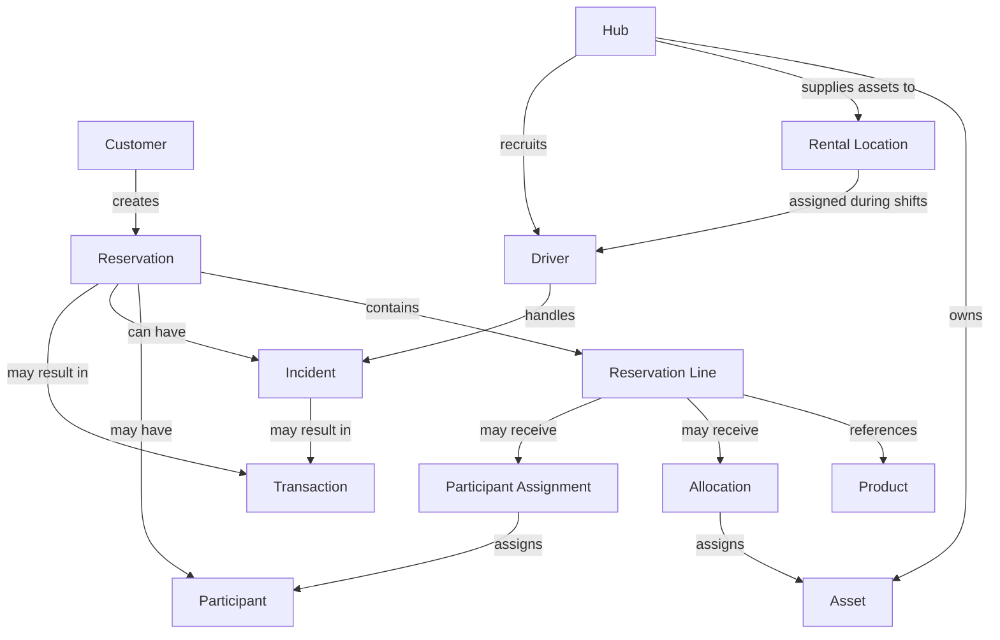

# FlowDock Domain Overview

This diagram shows the main business concepts within FlowDock.

```mermaid
flowchart TB

Customer[Customer]

Reservation[Reservation]

ReservationLine[Reservation Line]

Product[Product]

Allocation[Allocation]

ParticipantAssignment[Participant Assignment]

Asset[Asset]

Hub[Hub]

RentalLocation[Rental Location]

Driver[Driver]

Participant[Participant]

Incident[Incident]

Transaction[Transaction]


Customer -->|creates| Reservation

Reservation -->|contains| ReservationLine

Reservation -->|may have| Participant

ReservationLine -->|references| Product

ReservationLine -->|may receive| Allocation

Allocation -->|assigns| Asset

ReservationLine -->|may receive| ParticipantAssignment

ParticipantAssignment -->|assigns| Participant

Hub -->|owns| Asset

Hub -->|supplies assets to| RentalLocation

Hub -->|recruits| Driver

RentalLocation -->|assigned during shifts| Driver

Driver -->|handles| Incident

Reservation -->|can have| Incident

Reservation -->|may result in| Transaction

Incident -->|may result in| Transaction
```
