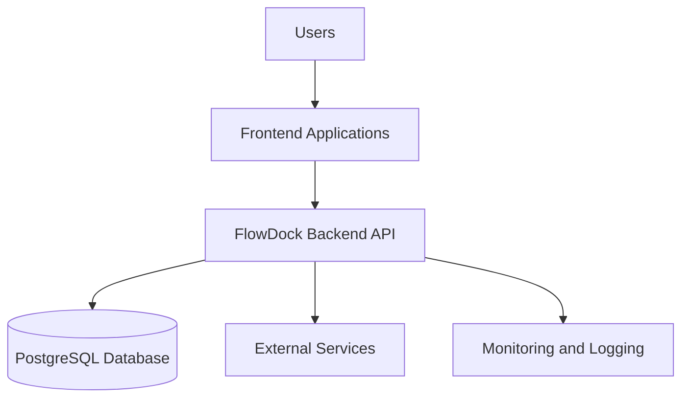

# Deployment Overview

This diagram shows the intended deployment direction for FlowDock.

The exact infrastructure is not decided yet.

```mermaid
flowchart TB

Users[Users]

Users --> Frontend[Frontend Applications]

Frontend --> Backend[FlowDock Backend API]

Backend --> Database[(PostgreSQL Database)]

Backend --> ExternalServices[External Services]

Backend --> Monitoring[Monitoring and Logging]
```
