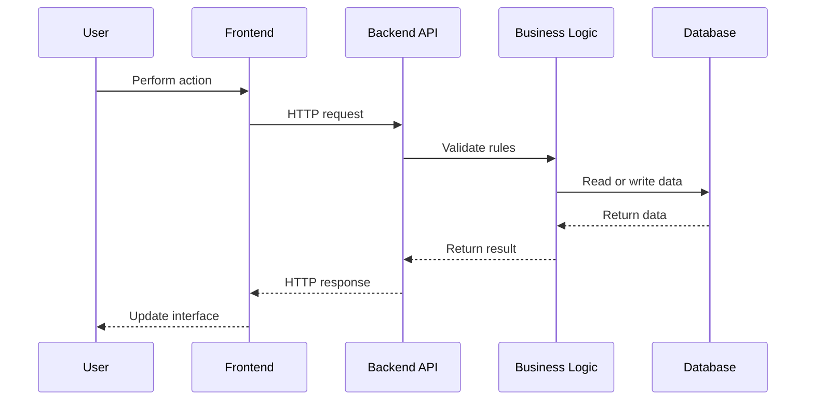

# Request Flow

This diagram shows how a request moves through the FlowDock system.

```mermaid
sequenceDiagram

User->>Frontend: Perform action

Frontend->>Backend API: HTTP request

Backend API->>Business Logic: Validate rules

Business Logic->>Database: Read or write data

Database-->>Business Logic: Return data

Business Logic-->>Backend API: Return result

Backend API-->>Frontend: HTTP response

Frontend-->>User: Update interface
```
